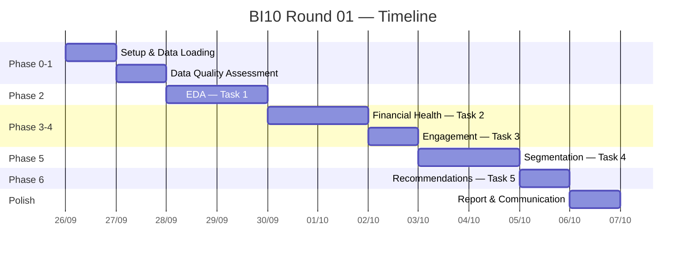

# 📋 BI10 Round 01 — Project Plan
## Consumer Financial Health & Engagement: Understanding Spending Behaviour and Building Meaningful Customer Segments

> **Cuộc thi**: BI10 — Vòng Sơ loại  
> **Chủ đề**: Phân tích sức khỏe tài chính, mức độ tương tác và phân khúc khách hàng  
> **Dữ liệu**: 1,852,394 giao dịch · 999 khách hàng · 34 tỉnh/thành · Năm 2025  

---

## Tổng quan đề bài

Một công ty tài chính tiêu dùng tại Việt Nam muốn chuyển từ tư duy **thu hồi nợ phản ứng** sang **chủ động hỗ trợ sức khỏe tài chính**. Đề bài yêu cầu hoàn thành **5 Task chính** + 1 Advanced (tuỳ chọn):

| Task | Tên | Trọng số |
|------|-----|----------|
| 1 | Exploratory Data Analysis (EDA) | 20% |
| 2 | Financial Health Analysis | 20% |
| 3 | Customer Engagement Analysis | 20% (kết hợp T2) |
| 4 | Customer Segmentation | 20% |
| 5 | Business Recommendations | 15% |
| — | Data Quality & Rigour (xuyên suốt) | 15% |
| — | Communication (xuyên suốt) | 10% |
| Bonus | Predictive Model (`next_month_low_health_flag`) | Bonus |

---

## Datasets

| File | Grain | Rows | Columns | Size |
|------|-------|------|---------|------|
| [consumer_transactions_2025.csv](file:///d:/3.%20Research%20%26%20Contest/BI10/PRELIMINARY%20PROJECT/%C4%90%E1%BB%80%20B%C3%80I/DATASET/consumer_transactions_2025.csv) | 1 row/transaction | ~1,852,394 | 28 | ~596 MB |
| [consumer_financial_health_engagement_2025.csv](file:///d:/3.%20Research%20%26%20Contest/BI10/PRELIMINARY%20PROJECT/%C4%90%E1%BB%80%20B%C3%80I/DATASET/consumer_financial_health_engagement_2025.csv) | 1 row/consumer/month | ~10,992 | 30 | ~3.3 MB |
| [data_dictionary.xlsx](file:///d:/3.%20Research%20%26%20Contest/BI10/PRELIMINARY%20PROJECT/%C4%90%E1%BB%80%20B%C3%80I/DATASET/data_dictionary.xlsx) | Từ điển dữ liệu | — | — | ~18 KB |
| [consumer_financial_health_case_study.md](file:///d:/3.%20Research%20%26%20Contest/BI10/PRELIMINARY%20PROJECT/%C4%90%E1%BB%80%20B%C3%80I/DATASET/consumer_financial_health_case_study.md) | Case study mô tả | — | — | ~10 KB |

> [!IMPORTANT]
> Dữ liệu là **giả lập (synthetic)**. Thu nhập, tín dụng, số dư có giá trị tuyệt đối phi thực tế. Chỉ sử dụng **các tỷ lệ (ratio)** khi so sánh giữa khách hàng.

---

## ⚙️ Cấu trúc thư mục đề xuất

```
PRELIMINARY PROJECT/
├── ĐỀ BÀI/                          # Đề bài gốc (không chỉnh sửa)
│   ├── BI10_ROUND01.pdf
│   └── DATASET/
├── notebooks/                         # Jupyter notebooks phân tích
│   ├── 00_data_quality.ipynb
│   ├── 01_eda.ipynb
│   ├── 02_financial_health.ipynb
│   ├── 03_engagement.ipynb
│   ├── 04_segmentation.ipynb
│   ├── 05_recommendations.ipynb
├── manuscript/                        # Chứa file kết quả raw (.md) cho slide

├── src/                               # Module Python tái sử dụng
│   ├── data_loader.py
│   ├── preprocessing.py
│   ├── visualization.py
│   └── segmentation.py
├── outputs/                           # Kết quả xuất ra
│   ├── figures/
│   ├── tables/
│   └── report/
├── requirements.txt
└── README.md
```

---

## 🗺️ MASTER OUTLINE — 6 Phase


---

## Phase 0 — Setup & Data Loading

> **Mục tiêu**: Thiết lập môi trường, load dữ liệu, hiểu cấu trúc ban đầu.

### 0.1 Cài đặt môi trường
- [ ] Tạo virtual environment (`python -m venv .venv`)
- [ ] Cài đặt thư viện: `pandas`, `numpy`, `matplotlib`, `seaborn`, `plotly`, `scikit-learn`, `openpyxl`, `scipy`
- [ ] Tạo `requirements.txt`

### 0.2 Load dữ liệu
- [ ] Đọc `consumer_transactions_2025.csv` → `df_txn` (~1.85M rows × 28 cols)
  - **Lưu ý**: File ~596MB, cần dùng `dtype` optimization hoặc đọc từng chunk
  - Cân nhắc convert sang parquet để tăng tốc lần đọc sau
- [ ] Đọc `consumer_financial_health_engagement_2025.csv` → `df_health` (~11K rows × 30 cols)
- [ ] Đọc `data_dictionary.xlsx` → hiểu định nghĩa từng cột

### 0.3 Kiểm tra sơ bộ
- [ ] `.shape`, `.info()`, `.describe()` cho cả 2 dataset
- [ ] Kiểm tra encoding tiếng Việt (UTF-8)
- [ ] Xác nhận key columns: `consumer_id`, `transaction_id`, `analysis_month`

### Deliverable Phase 0
- 2 DataFrame sạch sẵn sàng phân tích
- Ghi chú về data types, encoding issues (nếu có)

---

## Phase 1 — Data Quality Assessment

> **Mục tiêu**: Đánh giá chất lượng dữ liệu, xử lý vấn đề, đảm bảo tính nhất quán.  
> **Trọng số**: 15% (xuyên suốt)

### 1.1 Missing Values
- [ ] Đếm null/NaN cho từng cột trong cả 2 dataset
- [ ] Tạo heatmap missing values
- [ ] Quyết định chiến lược xử lý: drop / impute / flag

### 1.2 Duplicate Detection
- [ ] Kiểm tra `transaction_id` unique trong `df_txn`
- [ ] Kiểm tra `(consumer_id, analysis_month)` unique trong `df_health`
- [ ] Xử lý duplicate nếu có

### 1.3 Outlier Detection
- [ ] Box plot / IQR cho `spend_amount_vnd`
- [ ] Z-score analysis cho các trường numeric chính
- [ ] Quyết định: giữ nguyên (vì synthetic) hay flag outliers

### 1.4 Data Consistency
- [ ] Mỗi `consumer_id` → duy nhất 1 `customer_name`, `date_of_birth`, `street_address`
- [ ] Mỗi `merchant_id` → duy nhất 1 `merchant_name`
- [ ] `spend_amount_vnd` ≥ 0 và chia hết cho 1,000
- [ ] Tất cả timestamps nằm trong năm 2025

### 1.5 Temporal Coverage
- [ ] Kiểm tra 999 consumers × 12 months = phủ đầy hay có tháng thiếu?
- [ ] Phân bố giao dịch theo tháng — có gap bất thường?

### 1.6 Cross-dataset Consistency
- [ ] Tổng `spend_amount_vnd` từ `df_txn` theo (consumer, month) ≈ `total_spend_vnd` trong `df_health`
- [ ] Count transactions từ `df_txn` ≈ `transaction_count` trong `df_health`

### Deliverable Phase 1
- Bảng tổng hợp data quality report
- Danh sách issues phát hiện và cách xử lý
- Dataset đã cleaned cho các phase tiếp theo

---

## Phase 2 — Exploratory Data Analysis (Task 1)

> **Mục tiêu**: Trả lời 5 câu hỏi EDA + phân tích xu hướng chi tiêu, khu vực, kênh, nhân khẩu học.  
> **Trọng số**: 20%

### 2.1 Q1 — Tháng nào có tổng chi tiêu cao nhất?
- [ ] Tính `total_spend` theo tháng (từ `df_txn` hoặc `df_health`)
- [ ] Bar chart 12 tháng + highlight tháng cao nhất
- [ ] Tính % so với tổng chi tiêu năm
- [ ] **Output**: "Tháng X ghi nhận tổng chi Y VND, chiếm Z% tổng chi tiêu năm"

### 2.2 Q2 — Tỉnh/thành có chi tiêu cao nhưng tỷ lệ digital thấp
- [ ] Tính `total_spend` và `digital_share` (= online + e-commerce / total) theo `province_city`
- [ ] Tính trung bình `digital_share` toàn quốc
- [ ] Lọc: tỉnh top spend nhưng digital_share < mean
- [ ] Stacked bar chart so sánh POS vs Digital channels cho ≥2 tỉnh
- [ ] **Output**: Tên tỉnh, số liệu, biểu đồ so sánh kênh

### 2.3 Q3 — Top category theo số giao dịch vs top theo tổng chi tiêu
- [ ] Group by `spending_category` → count vs sum
- [ ] So sánh average ticket size (VND/transaction) giữa 2 category
- [ ] Dual-axis bar chart hoặc scatter plot
- [ ] **Output**: 2 categories, average ticket sizes, giải thích khác biệt

### 2.4 Q4 — Nhóm tuổi nào active nhưng financial health thấp nhất?
- [ ] Tạo age cohort bins (18-25, 26-35, 36-45, 46-55, 55+)
- [ ] Tính: avg `transaction_count`, avg `financial_health_score` theo cohort
- [ ] Lọc: cohort có active frequency cao nhưng health score thấp nhất
- [ ] So sánh `essential_spend_ratio` và `spend_to_income_ratio`
- [ ] Grouped bar chart hoặc radar chart
- [ ] **Output**: Cohort, metrics, giải thích nguyên nhân

### 2.5 Q5 — Phân tích xu hướng chi tiêu theo thời gian (Objectives bổ sung)
- [ ] Line chart: tổng chi tiêu theo tháng (chia essential vs discretionary)
- [ ] Phân tích seasonal patterns
- [ ] Heatmap: spending by category × month

### 2.6 Spending Structure Decomposition
- [ ] Decompose: transaction volume effect vs ticket size effect
- [ ] Essential vs Discretionary allocation ratio theo tháng
- [ ] Sunburst hoặc treemap cho spending breakdown

### Deliverable Phase 2
- Trả lời chính xác 5 câu hỏi với **số liệu cụ thể** (VND, %, tỷ lệ)
- ≥ 6 biểu đồ EDA chất lượng cao
- Business interpretation cho mỗi finding

---

## Phase 3 — Financial Health Analysis (Task 2)

> **Mục tiêu**: Phân tích sức khỏe tài chính, tìm yếu tố ảnh hưởng, xác định nhóm "stressed but engaged".  
> **Trọng số**: 20% (kết hợp Task 3)

### 3.1 Phân bố Financial Health Score
- [ ] Histogram + KDE plot cho `financial_health_score`
- [ ] Box plot theo `financial_health_segment` (Ổn định / Cần cải thiện / Cảnh báo / ...)
- [ ] Thống kê: mean, median, std, skewness
- [ ] Phân bố theo tháng (có cải thiện hay xấu đi theo thời gian?)

### 3.2 Yếu tố chính ảnh hưởng đến sức khỏe thấp
- [ ] Correlation matrix: `financial_health_score` vs các ratio features
  - `spend_to_income_ratio`
  - `credit_utilization_ratio`
  - `essential_spend_ratio`
  - `spending_volatility`
  - `online_spend_ratio`
- [ ] Feature importance (Random Forest hoặc XGBoost regressor)
- [ ] Partial dependence plots cho top 3-5 drivers
- [ ] **Lưu ý**: Chỉ dùng **ratio**, KHÔNG dùng giá trị VND tuyệt đối

### 3.3 Khác biệt theo Occupation, Age, Province
- [ ] Box plot `financial_health_score` theo occupation (top 10)
- [ ] Violin plot theo age cohort
- [ ] Choropleth map hoặc bar chart theo province (top 15)
- [ ] ANOVA / Kruskal-Wallis test nếu cần kiểm tra statistical significance

### 3.4 Xác định nhóm "Financially Stressed but Highly Engaged"
- [ ] **Định nghĩa rule rõ ràng**: VD `financial_health_score < 40` AND `engagement_score >= 70`
- [ ] Tính kích thước nhóm (n, %)
- [ ] Profile nhóm: avg age, top occupations, top provinces, spending patterns
- [ ] So sánh với nhóm "Healthy & Engaged" và "Stressed & Disengaged"
- [ ] **Output**: Rule + kích thước + profile + recommendation hướng

### Deliverable Phase 3
- Phân bố và thống kê health score
- Top drivers of low health (với evidence)
- Demographic breakdown
- **Crossover segment** đã identify với rule + profile

---

## Phase 4 — Customer Engagement Analysis (Task 3)

> **Mục tiêu**: Phân tích mức độ tương tác, kênh, đa dạng category, xác định nhóm "healthy but disengaged".  
> **Trọng số**: (chung 20% với Task 2)

### 4.1 Phân bố Engagement Score
- [ ] Histogram + KDE cho `engagement_score`
- [ ] Pie / Donut chart theo `engagement_segment`
- [ ] Tỷ lệ % khách hàng trong mỗi segment

### 4.2 Channel Adoption Breakdown
- [ ] Tính tỷ lệ giao dịch theo channel: POS, QR, E-commerce, Mobile App, Recurring
- [ ] Stacked bar chart hoặc 100% stacked area chart
- [ ] Digital spend ratio distribution
- [ ] Trend theo tháng — digital adoption có tăng?

### 4.3 Category Diversity
- [ ] Distribution của `category_diversity` (histogram)
- [ ] Scatter plot: `category_diversity` vs `engagement_score` → correlation?
- [ ] Tính Pearson/Spearman correlation

### 4.4 Recency & Frequency
- [ ] Distribution: `transaction_recency_days` (bao lâu kể từ giao dịch gần nhất)
- [ ] Distribution: `transaction_count` và `active_transaction_days`
- [ ] Scatter: recency vs engagement_score, frequency vs engagement_score
- [ ] Highlight nhóm high recency (lâu không giao dịch) → rủi ro churn

### 4.5 Xác định nhóm "Financially Healthy but Disengaged"
- [ ] **Định nghĩa cutoff** (giải thích tại sao chọn mức này):
  - VD: `financial_health_score >= 70` AND `engagement_score < 40`
  - So sánh với cutoff stricter (≥80, <30) và looser (≥60, <50) → justify
- [ ] Kích thước chính xác: n customers, % tổng
- [ ] Profile: demographics, spending patterns, preferred channels
- [ ] Đây là **retention/growth opportunity** — giải thích tại sao

### Deliverable Phase 4
- Engagement distribution + segment share
- Channel breakdown chi tiết
- Category diversity ↔ engagement relationship
- Recency/frequency ranges + engagement link
- **High-health, low-engagement group**: exact size + profile + cutoff justification

---

## Phase 5 — Customer Segmentation (Task 4)

> **Mục tiêu**: Xây dựng phân khúc khách hàng data-driven, profile và so sánh.  
> **Trọng số**: 20%

### 5.1 Data Preprocessing & Feature Engineering
- [ ] Chọn features cho segmentation từ 4 dimension:
  - **Demographics**: `age`, `gender`, `occupation`, `province_city`
  - **Financial Health**: `financial_health_score`, `credit_utilization_ratio`, `spend_to_income_ratio`, `spending_volatility`
  - **Engagement**: `engagement_score`, `transaction_count`, `active_transaction_days`, `transaction_recency_days`
  - **Spending Behavior**: `essential_spend_ratio`, `discretionary_spend_ratio`, `online_spend_ratio`, `category_diversity`
- [ ] Aggregate từ consumer-month → **consumer-level** (mean/median across months)
- [ ] StandardScaler / MinMaxScaler cho numerical features
- [ ] Handle categorical variables nếu dùng cho clustering

### 5.2 Model Selection & Implementation

#### Option A: Rule-Based Matrix (2×2 hoặc 3×3)
- [ ] Dùng `financial_health_segment` × `engagement_segment` → ma trận
- [ ] Bổ sung rules cho "Emerging Digital" (online_spend_ratio cao) và "Essential-Focused" (essential_spend_ratio cao)

#### Option B: K-Means Clustering
- [ ] Elbow method → chọn k
- [ ] Silhouette analysis → validate k
- [ ] Fit K-Means trên scaled features
- [ ] PCA 2D visualization

#### Option C: Hybrid (Recommended ✅)
- [ ] K-Means clustering → gán cluster labels
- [ ] Áp business rules lên clusters → gán tên segment có ý nghĩa
- [ ] Đảm bảo **100% customer coverage** (không ai bị miss)

### 5.3 Suggested Segments (6 nhóm)
| # | Segment | Mô tả dự kiến |
|---|---------|---------------|
| 1 | **Financially Healthy & Highly Engaged** | Health ↑, Engagement ↑ — Khách hàng lý tưởng |
| 2 | **Financially Healthy but Disengaged** | Health ↑, Engagement ↓ — Cơ hội retention/growth |
| 3 | **Financially Stretched but Highly Engaged** | Health ↓, Engagement ↑ — Cần hỗ trợ, không trừng phạt |
| 4 | **Low Engagement & Financially Vulnerable** | Health ↓, Engagement ↓ — Rủi ro cao nhất |
| 5 | **Emerging Digital Customers** | Online ratio cao, đang chuyển đổi số |
| 6 | **Essential-Spend-Focused** | Essential ratio rất cao, chi tiêu cơ bản |

### 5.4 Customer Profiling & Post-Segmentation Analysis
- [ ] Profile mỗi segment: kích thước, avg age, gender split, top occupations, top provinces
- [ ] Radar chart so sánh 6 segments trên 5-6 metrics chính
- [ ] Heatmap: segment × metric
- [ ] Side-by-side comparison table

### 5.5 Limitations & Future Work
- [ ] Dữ liệu synthetic → bias trong income/credit magnitudes
- [ ] Engagement skew high → phân biệt chủ yếu qua digital adoption
- [ ] Temporal stability: segments có ổn định qua các tháng?
- [ ] Gợi ý: thêm CLV, churn prediction, real-time segmentation

### Deliverable Phase 5
- Preprocessed dataset với engineered features
- Segmentation model (code + output)
- Profile chi tiết 6 segments
- Side-by-side comparison chart/table
- Limitations & future work section

---

## Phase 6 — Business Recommendations (Task 5)

> **Mục tiêu**: Đề xuất 6 loại intervention **phi trừng phạt**, gắn với data, có target group + reach.  
> **Trọng số**: 15%

> [!CAUTION]
> **RULE BẮT BUỘC**: `financial_health_score` **KHÔNG BAO GIỜ** được dùng để từ chối tín dụng, cắt hạn mức, hay khoá tài khoản.

### 6.1 — Budgeting Tools (Công cụ quản lý ngân sách)
- [ ] **Target**: Nhóm có `spend_to_income_ratio` > median hoặc segment "Stretched"
- [ ] **Action**: App/feature theo dõi chi tiêu theo category, so sánh với thu nhập
- [ ] **Data evidence**: Tỷ lệ cụ thể, số KH, % population
- [ ] **Reach estimate**: n customers

### 6.2 — Spend Alerts (Cảnh báo chi tiêu)
- [ ] **Target**: KH có `spending_volatility` cao hoặc discretionary_spend_ratio tăng đột biến
- [ ] **Action**: Push notification khi chi tiêu vượt ngưỡng tháng trước
- [ ] **Data evidence**: Phân bố volatility, ngưỡng cảnh báo
- [ ] **Reach estimate**: n customers

### 6.3 — Financial-Planning Reminders (Nhắc nhở kế hoạch tài chính)
- [ ] **Target**: Nhóm trẻ (18-30) có health score thấp hơn trung bình
- [ ] **Action**: Nhắc nhở cuối tháng về mục tiêu tiết kiệm, review chi tiêu
- [ ] **Data evidence**: Age cohort × health score analysis
- [ ] **Reach estimate**: n customers

### 6.4 — Financial-Education Content (Nội dung giáo dục tài chính)
- [ ] **Target**: Segment "Vulnerable" hoặc essential_spend_ratio rất thấp
- [ ] **Action**: Series bài viết/video về quản lý chi tiêu, tiết kiệm
- [ ] **Data evidence**: Profile segment mục tiêu
- [ ] **Reach estimate**: n customers

### 6.5 — Digital-Channel Nudges (Khuyến khích dùng kênh số)
- [ ] **Target**: Tỉnh có digital_share thấp (từ Q2 EDA) + KH có online_spend_ratio < median
- [ ] **Action**: Ưu đãi/cashback cho giao dịch qua Mobile App, QR
- [ ] **Data evidence**: Province × channel analysis
- [ ] **Reach estimate**: n customers

### 6.6 — Product Suggestions (Gợi ý sản phẩm phù hợp)
- [ ] **Target**: Segment "Healthy & Engaged" (upsell) và "Emerging Digital" (cross-sell)
- [ ] **Action**: Thẻ credit cao cấp hơn, bảo hiểm, đầu tư cho nhóm healthy; ví điện tử cho nhóm digital
- [ ] **Data evidence**: Spending patterns + category diversity
- [ ] **Reach estimate**: n customers

### 6.7 Prioritisation Matrix
- [ ] Bảng xếp hạng 6 interventions theo:
  - **Reach** (bao nhiêu KH?)
  - **Driver strength** (evidence mạnh cỡ nào?)
  - **Implementation effort** (dễ hay khó triển khai?)
- [ ] **Credit-decision rule statement**: "financial_health_score sẽ không được sử dụng trong bất kỳ quyết định phê duyệt/từ chối tín dụng nào"

### Deliverable Phase 6
- 6 đề xuất intervention, mỗi cái có: target group (n, %), evidence, action
- Prioritisation matrix
- Credit-decision rule statement

---

## 📊 Timeline đề xuất



---

## ✅ Checklist tổng quan

- [ ] **Phase 0**: Setup, load data, hiểu cấu trúc
- [ ] **Phase 1**: Data quality report — missing, duplicates, outliers, consistency
- [ ] **Phase 2 (Task 1)**: Trả lời 5 câu hỏi EDA với số liệu + biểu đồ
- [ ] **Phase 3 (Task 2)**: Health score distribution, drivers, demographics, crossover segment
- [ ] **Phase 4 (Task 3)**: Engagement distribution, channels, diversity, recency, healthy-but-disengaged
- [ ] **Phase 5 (Task 4)**: Segmentation model, 6 segments profiled, side-by-side comparison
- [ ] **Phase 6 (Task 5)**: 6 non-punitive interventions, prioritisation, credit rule statement
- [ ] **Communication**: Narrative rõ ràng cho business audience, đủ biểu đồ chất lượng

---

> [!TIP]
> **Chiến lược ghi điểm cao**:
> 1. Luôn dùng **ratio** thay vì absolute VND khi so sánh KH
> 2. Mọi claim phải có **số liệu hoặc biểu đồ** đi kèm — không assertion trống
> 3. Recommendation phải **non-punitive** — hỗ trợ, không trừng phạt
> 4. Biểu đồ phải phù hợp loại data — đừng dùng pie chart cho time series
> 5. Giải thích **tại sao** chọn cutoff cho crossover segments
