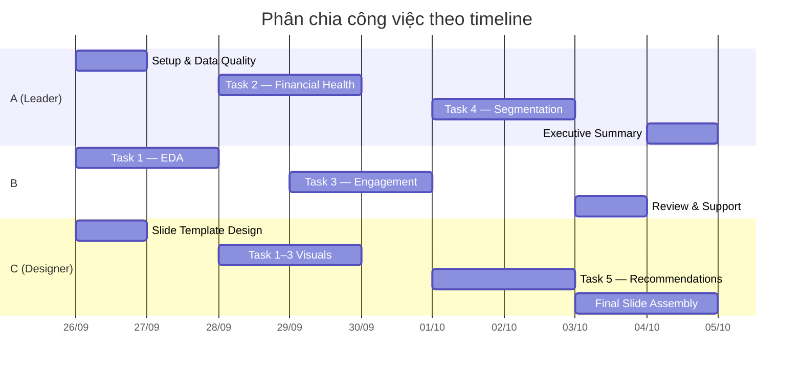

# 📋 Bunnytics — Task Assignment Board
## BI10 Round 01 · Nhóm 3 người

> **Repo**: [Bunnytics_BI10_Round1](https://github.com/duongdaominhduc-pixel/Bunnytics_BI10_Round1)  
> **Deadline**: _[Cập nhật deadline]_  
> **Last updated**: 2026-09-25

---

## 👥 Team Members

| Ký hiệu | Tên | Role | GitHub |
|----------|-----|------|--------|
| **A** | _[Tên thành viên 1]_ | Leader / Data Analyst | _@username_ |
| **B** | _[Tên thành viên 2]_ | Data Analyst | _@username_ |
| **C** | _[Tên thành viên 3]_ | Data Analyst / Designer | _@username_ |

---

## 📊 Task Assignment Table

### Legend
- 🔴 Not started · 🟡 In progress · 🟢 Done · 👤 Primary · 👥 Support

---

### Phase 0–1: Setup & Data Quality

| # | Task | Người phụ trách | Support | Status | Deadline | Notes |
|---|------|----------------|---------|--------|----------|-------|
| 0.1 | Setup môi trường, venv, requirements | A | — | 🟢 | — | Đã xong |
| 0.2 | Load data, kiểm tra cấu trúc | A | — | 🟢 | — | Đã xong |
| 1.1 | Missing values analysis | A | — | 🟢 | | |
| 1.2 | Duplicate detection | A | — | 🟢 | | |
| 1.3 | Outlier detection | A | — | 🟢 | | |
| 1.4 | Data consistency checks | A | — | 🟢 | | |
| 1.5 | Temporal coverage check | A | — | 🟢 | | Tại sao 10,992 thay vì 11,988? |
| 1.6 | Cross-dataset consistency | A | — | 🟢 | | txn ↔ monthly match? |

---

### Phase 2: Task 1 — EDA (20%)

| # | Task | Người phụ trách | Support | Status | Deadline | Notes |
|---|------|----------------|---------|--------|----------|-------|
| 2.1 | **Q1**: Tháng chi tiêu cao nhất (VND + %) | B | — | 🔴 | | Bar chart 12 tháng |
| 2.2 | **Q2**: Tỉnh chi tiêu cao + digital thấp | B | — | 🔴 | | ≥ 2 tỉnh, channel breakdown |
| 2.3 | **Q3**: Top category (count vs spend) | B | — | 🔴 | | Avg ticket size comparison |
| 2.4 | **Q4**: Age cohort active nhưng health thấp | B | A | 🔴 | | essential_ratio, spend_to_income |
| 2.5 | Spending decomposition & seasonal | B | — | 🔴 | | Essential vs Discretionary |
| 2.6 | Slide #6–9: Tổng hợp visual cho Task 1 | C | B | 🔴 | | Thiết kế biểu đồ đẹp |

---

### Phase 3: Task 2 — Financial Health (20%)

| # | Task | Người phụ trách | Support | Status | Deadline | Notes |
|---|------|----------------|---------|--------|----------|-------|
| 3.1 | Health score distribution + trends | A | — | 🟢 | | Histogram, KDE, monthly trend |
| 3.2 | Drivers of low health (correlation + FI) | A | — | 🟢 | | Feature importance, ratio-based |
| 3.3 | Khác biệt theo occupation, age, province | A | C | 🟢 | | Box/violin plots |
| 3.4 | **Crossover: Stressed × Engaged** | A | B | 🟢 | | Rule + size + profile |
| 3.5 | Slide #10–12: Tổng hợp visual cho Task 2 | C | A | 🔴 | | |

---

### Phase 4: Task 3 — Engagement (20%)

| # | Task | Người phụ trách | Support | Status | Deadline | Notes |
|---|------|----------------|---------|--------|----------|-------|
| 4.1 | Engagement score distribution + segments | B | — | 🔴 | | Histogram + donut |
| 4.2 | Channel adoption breakdown | B | — | 🔴 | | POS/QR/E-com/App/Recurring |
| 4.3 | Category diversity ↔ engagement | B | — | 🔴 | | Scatter + correlation |
| 4.4 | Recency & frequency ↔ engagement | B | — | 🔴 | | Churn risk identification |
| 4.5 | **Crossover: Healthy × Disengaged** | B | A | 🔴 | | Cutoff + justification + profile |
| 4.6 | Slide #13–14: Tổng hợp visual cho Task 3 | C | B | 🔴 | | |

---

### Phase 5: Task 4 — Segmentation (20%)

| # | Task | Người phụ trách | Support | Status | Deadline | Notes |
|---|------|----------------|---------|--------|----------|-------|
| 5.1 | Feature engineering & preprocessing | A | B | 🔴 | | 4 dimensions, scaling |
| 5.2 | Model selection (K-Means / Rule-based) | A | B | 🔴 | | Elbow, silhouette |
| 5.3 | Build 6 segment profiles | A | B | 🔴 | | Radar chart, summary table |
| 5.4 | Post-segmentation comparison | A | — | 🔴 | | Heatmap, side-by-side |
| 5.5 | Limitations & future work | A | B | 🔴 | | |
| 5.6 | Slide #15–18: Tổng hợp visual cho Task 4 | C | A | 🔴 | | |

---

### Phase 6: Task 5 — Recommendations (15%)

| # | Task | Người phụ trách | Support | Status | Deadline | Notes |
|---|------|----------------|---------|--------|----------|-------|
| 6.1 | Budgeting Tools — đề xuất + target + data | C | A | 🔴 | | |
| 6.2 | Spend Alerts — đề xuất + target + data | C | A | 🔴 | | |
| 6.3 | Financial-Planning Reminders | C | B | 🔴 | | |
| 6.4 | Financial-Education Content | C | B | 🔴 | | |
| 6.5 | Digital-Channel Nudges | C | B | 🔴 | | Link to Q2 findings |
| 6.6 | Product Suggestions | C | A | 🔴 | | |
| 6.7 | Prioritisation matrix + credit rule | C | A | 🔴 | | |
| 6.8 | Slide #19–20: Tổng hợp visual cho Task 5 | C | — | 🔴 | | |

---

### Slide Proposal & Communication (10%)

| # | Task | Người phụ trách | Support | Status | Deadline | Notes |
|---|------|----------------|---------|--------|----------|-------|
| S.1 | Thiết kế template slide (16:9, color palette) | C | — | 🔴 | | Canva / PowerPoint |
| S.2 | Slide #1: Cover page | C | — | 🔴 | | Team info, logo |
| S.3 | Slide #2: Executive Summary | A | B, C | 🔴 | | **Viết cuối cùng** |
| S.4 | Slide #3: Table of Contents | C | — | 🔴 | | |
| S.5 | Slide #4–5: Introduction | C | A | 🔴 | | Business context + data quality |
| S.6 | Slide #21: Key Takeaways | A | B | 🔴 | | |
| S.7 | Slide #22: Thank You & Contact | C | — | 🔴 | | |
| S.8 | Review toàn bộ slide, chỉnh sửa cuối | A, B, C | — | 🔴 | | Cả nhóm review |

---

## 📈 Workload Summary

| Thành viên | Primary Tasks | Trọng tâm |
|------------|--------------|------------|
| **A** | Phase 0–1, Task 2, Task 4, Exec Summary | Data Quality, Financial Health, Segmentation |
| **B** | Task 1, Task 3 | EDA, Engagement Analysis |
| **C** | Task 5, Slide Design, Visual | Recommendations, Presentation, Chart Design |

---

## 📌 Workflow Rules

1. **Branch naming**: `feature/task1-eda`, `feature/task2-health`, `feature/task4-segmentation`, ...
2. **Commit messages**: `[Task X] Brief description` — ví dụ `[Task 1] Add Q1 monthly spend analysis`
3. **Pull requests**: Tạo PR khi xong mỗi task, assign reviewer = 1 người khác trong nhóm
4. **Data files**: KHÔNG commit file CSV lớn (đã có `.gitignore`). Mỗi người tự download dataset vào folder `ĐỀ BÀI/DATASET/`
5. **Communication**: Cập nhật status trong file này khi bắt đầu (🟡) và hoàn thành (🟢) task

---

## ✅ Progress Tracker

| Phase | Task | Status | % Complete |
|-------|------|--------|------------|
| Phase 0–1 | Setup & Data Quality | 🟢 | 100% |
| Phase 2 | Task 1 — EDA | 🔴 | 0% |
| Phase 3 | Task 2 — Financial Health | 🟢 | 100% |
| Phase 4 | Task 3 — Engagement | 🔴 | 0% |
| Phase 5 | Task 4 — Segmentation | 🟢 | 100% |
| Phase 6 | Task 5 — Recommendations | 🔴 | 0% |
| Slides | Proposal (22 slides) | 🔴 | 0% |
| **Overall** | | 🟡 | **~5%** |
